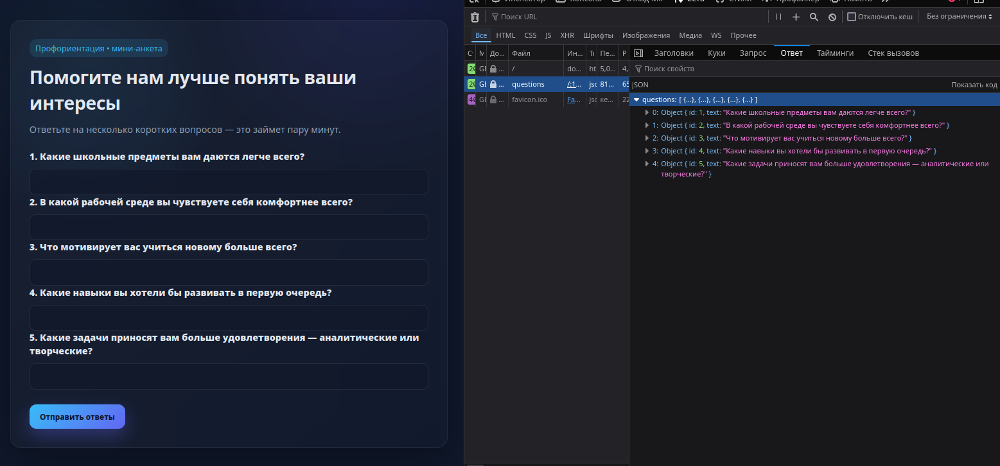
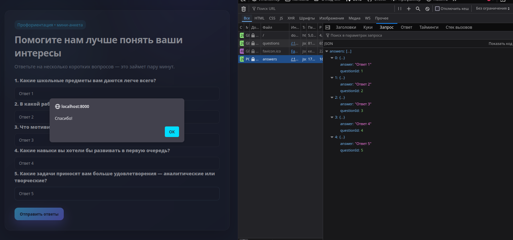
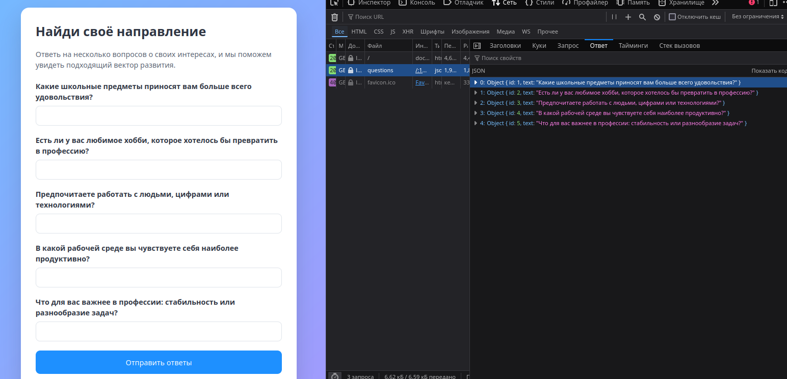
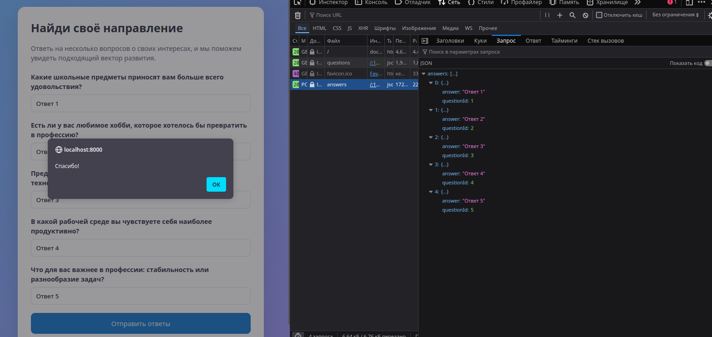

# Описание

+ Относительно долго собирал стартовый промпт. "Заказал" у ИИ максимально простой фронт. Это позволило получить результат с одного промпта.
+ Использованы 2 инструмента: из IDE - **Cursor**, а из CLI - **Codex**. В обоих проектах использован одинаковый промпт (представлен ниже).
+ Инструкции по запуску лежат в директориях проектов: `ide_cursor` и `cli_codex`
```
Действуй как опытный Fullstack-разработчик. Если тебе не хватит данных, то задай необходимые вопросы.
Сгенерируй простое монолитное приложение анкету.  

Backend на python, по возможности, без использования фреймворков и без валидации входных данных предоставляет два API:
	GET "/questions" - возвращает список (3–5 шт.) жёстко заданных вопросов анкеты на тему профориентации (установи любые) в формате json.
	POST "/answers" - принимает ответы пользователя и сохраняет их в памяти (например, в slice/array/map).

Frontend:
    вёрстка в файле index.html с любой кастомной стилизацией на CSS. Vanilla JS;
    загружает вопросы от API Backend после загрузки страницы и на основе них генерирует форму;
	текст каждого вопроса выделен тегом strong, а поле для ответа находится под вопросом и имеет input type text;
    отправляет заполненные ответы через POST "/answers";
    показывает пользователю сообщение «Спасибо!» с помощью alert;

Развертывание:
	Сгенерируй docker-compose.yml и всё, что нужно для легкого локального развертывания
	В корне сгенерируй README.md с инструкцией по запуску

Формат вывода:
	Не используй заглушки, пиши полный функциональный код MVP.
```

## Скриншоты результатов
### Cursor (auto)



### Codex

